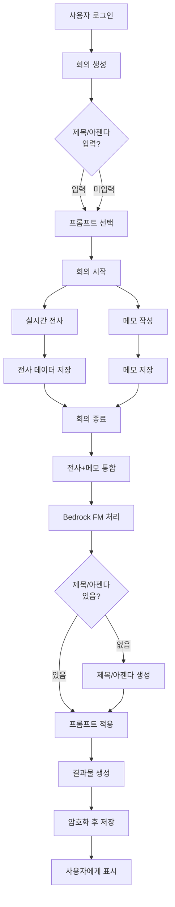

# TransNote 상세 기능 명세서

> 작성일: 2026.01.25  
> 버전: 1.0.0  
> 상태: Draft

---

## 📋 목차
1. [서비스 핵심 개념](#1-서비스-핵심-개념)
2. [기능 명세](#2-기능-명세)
3. [데이터 모델](#3-데이터-모델)
4. [API 명세](#4-api-명세)
5. [워크플로우](#5-워크플로우)
6. [보안 요구사항](#6-보안-요구사항)
7. [기술 스택](#7-기술-스택)
8. [개발 우선순위](#8-개발-우선순위)

---

## 1. 서비스 핵심 개념

### 1.1 서비스 정의
TransNote는 **회의록 자동 생성과 메모를 통합한 개인 전용 웹 서비스**입니다.

### 1.2 핵심 가치
- ✅ **자동화**: 음성을 실시간으로 텍스트로 전사
- ✅ **맞춤화**: 사용자 정의 프롬프트로 원하는 형태의 회의록 생성
- ✅ **보안**: 암호화된 개인 전용 데이터 관리
- ✅ **통합**: 전사와 메모를 하나의 결과물로 통합

### 1.3 타겟 사용자
- 회사 회의 참석자 (회의록 자동화)
- 1:1 미팅 참가자 (메모 보조)
- 강의/세미나 참석자 (필기 자동화)
- 개인 연구자/학습자 (음성 노트)

### 1.4 차별점
**맞춤형 프롬프트 시스템**: 회의록, 강의, 세미나 등 상황에 맞는 결과물 생성

---

## 2. 기능 명세

### 2.1 회의 관리

#### 2.1.1 회의 생성
| 항목 | 설명 | 필수 여부 |
|------|------|----------|
| 회의 제목 | 회의 이름 | 선택 |
| 회의 아젠다 | 주요 논의 사항 | 선택 |
| 프롬프트 선택 | 적용할 프롬프트 | 선택 (기본값: 회의록) |

**비즈니스 규칙:**
- 제목/아젠다 미입력 시 → FM 모델이 전사 내용으로 자동 생성
- 프롬프트 미선택 시 → 기본 프롬프트 "회의록" 자동 적용
- 프롬프트는 회의 종료 전까지 변경 가능

#### 2.1.2 회의 진행
```
[시작] → [실시간 전사] + [메모 작성] → [종료] → [결과 생성]
```

**실시간 전사:**
- AWS Transcribe Streaming 사용
- 화면에 실시간으로 텍스트 표시
- 타임스탬프 자동 기록

**메모 작성:**
- 사용자가 자유롭게 메모 입력
- 메모 작성 시점 타임스탬프 자동 연동

**제약 사항:**
- 🚫 녹음 파일은 저장하지 않음 (스트림 처리만)
- ⚠️ 최대 회의 시간: 4시간

#### 2.1.3 회의 종료
- "회의 종료" 버튼 클릭
- 전사 데이터 + 메모 → Bedrock FM 모델 전송
- 선택된 프롬프트 적용
- 구조화된 결과물 생성

#### 2.1.4 회의 목록 조회
- 본인이 생성한 회의만 조회
- 정렬: 최신순
- 필터: 날짜 범위, 프롬프트 종류

---

### 2.2 프롬프트 시스템

#### 2.2.1 기본 프롬프트
**특징:**
- 시스템이 제공
- 수정/삭제 불가
- 항상 사용 가능

**제공 프롬프트:**
1. **회의록 프롬프트** (기본값)
   - 안건, 논의 요약, 결정사항, 액션 아이템 구조화
   - 담당자, 마감일 자동 추출
2. **강의 프롬프트**
   - 핵심 개념, 예시, 실습 내용 정리
3. **세미나 프롬프트**
   - 발표자별 주요 내용, Q&A 정리

#### 2.2.2 사용자 프롬프트
**기능:**
- 생성: 프롬프트 이름 + 내용 입력
- 수정: 기존 프롬프트 내용 편집
- 삭제: 사용자 프롬프트만 삭제 가능
- 적용: 회의 시작 시 선택

**프롬프트 구조:**
```json
{
  "id": "user_prompt_001",
  "name": "일일 스탠드업 미팅",
  "content": "# ROLE\n당신은...",
  "createdAt": "2026-01-25T00:00:00Z",
  "updatedAt": "2026-01-25T00:00:00Z",
  "isDefault": false
}
```

#### 2.2.3 프롬프트 예시 (회의록)
```markdown
# ROLE
당신은 전문 회의록 작성 AI입니다. 복잡하고 다양한 주제가 논의된 회의 내용을 구조화된 회의록으로 정리하는 것이 주요 임무입니다.

# CORE PRINCIPLES
- 객관성: 개인 의견이나 해석 배제, 사실만 기록
- 정확성: 발언자와 내용을 정확히 매칭
- 완전성: 모든 안건과 결정사항 누락 없이 포함
- 실행성: 액션 아이템은 구체적이고 측정 가능하게 작성

# OUTPUT FORMAT
반드시 다음 구조를 따라 출력하세요:

## 안건 [번호]: [제목]
**논의 요약:**
- [핵심 논의 내용을 3-5개 불릿포인트로 요약]

**결정사항:**
- [명확한 결론. "결정됨/보류됨/다음회의 이관" 중 하나 명시]

**액션 아이템:**
| ID | 작업 내용 | 담당자 | 마감일 | 우선순위 |
|----|----------|--------|--------|----------|
| A001 | [구체적 작업] | [이름] | [날짜] | [High/Medium/Low] |

**미해결 사항:**
- [다음 회의에서 다룰 항목들]

---

## 전체 요약
**주요 결정사항:** [회의의 핵심 결정 3개 이내]
**총 액션 아이템:** [개수]개
**다음 회의 안건:** [이관된 주요 안건들]
```

---

### 2.3 노트 작성 (Note-First Approach)

#### 2.3.1 노트 중심 UI
**핵심 개념**: 사용자가 직접 노트를 작성하고, 전사는 보조 도구로 활용

**동작 방식**:
- 회의 중 사용자가 Markdown 형식으로 자유롭게 노트 작성
- 실시간 전사는 백그라운드에서 진행 (접기/펼치기 가능)
- 노트 + 전사를 AI가 통합하여 최종 회의록 생성
- 자동 저장 (3초 디바운스)

**참고 사례**: Cleft Notes, Granola, Reflect

#### 2.3.2 노트 데이터 구조
```typescript
interface Note {
  id: string;
  meetingId: string;
  content: string; // Markdown 형식
  createdAt: Date;
  updatedAt: Date;
}
```

**저장 방식**:
- 사용자가 작성한 노트 전체를 하나의 Markdown 문서로 저장
- 암호화 후 DB 저장
- 3초 디바운스로 자동 저장

---

### 2.4 전사 (Transcription)

#### 2.4.1 실시간 전사 (백그라운드)
- AWS Transcribe Streaming 사용
- 음성 → 텍스트 실시간 변환
- 백그라운드에서 처리, UI에서는 접기/펼치기 가능
- 사용자는 노트 작성에 집중

#### 2.4.2 전사 데이터 구조
```typescript
interface TranscriptSegment {
  id: string;
  meetingId: string;
  startTime: number; // 초
  endTime: number; // 초
  text: string; // 전사된 텍스트
  confidence: number; // 신뢰도 (0-1)
  createdAt: Date;
}
```

#### 2.4.3 제약 사항
- 🚫 **녹음 파일 미저장**: 스트림 처리만 수행
- ✅ **전사 텍스트만 저장**: 암호화 후 DB 저장

---

### 2.5 결과물 생성

#### 2.5.1 생성 프로세스
```
1. 회의 종료 버튼 클릭
   ↓
2. 전사 데이터 + 메모 수집
   ↓
3. 선택된 프롬프트 적용
   ↓
4. AWS Bedrock FM 모델 호출
   ↓
5. 구조화된 결과물 생성
   ↓
6. 암호화 후 DB 저장
```

#### 2.5.2 결과물 구조
```typescript
interface MeetingResult {
  id: string;
  meetingId: string;
  promptId: string;
  content: string; // Markdown 형식의 회의록
  metadata: {
    title?: string;
    agenda?: string;
    generatedAt: Date;
    totalDuration: number; // 초
    transcriptWordCount: number;
    memoCount: number;
  };
  createdAt: Date;
}
```

#### 2.5.3 결과물 예시 (회의록 프롬프트 적용)
```markdown
# 2026년 1분기 마케팅 전략 회의

**회의 일시:** 2026-01-25 14:00-15:30
**참석자:** (AI 자동 추출 또는 사용자 입력)

---

## 안건 1: 신규 제품 런칭 전략
**논의 요약:**
- 타겟 고객층을 20-30대로 확정
- 소셜 미디어 중심 마케팅 전략 수립 필요
- 예산은 5천만원으로 확정

**결정사항:**
- 3월 1일 공식 런칭 결정됨

**액션 아이템:**
| ID | 작업 내용 | 담당자 | 마감일 | 우선순위 |
|----|----------|--------|--------|----------|
| A001 | 소셜 미디어 캠페인 기획서 작성 | 김마케팅 | 2026-02-01 | High |
| A002 | 인플루언서 섭외 | 이소셜 | 2026-02-05 | Medium |

**미해결 사항:**
- 구체적인 예산 배분은 다음 회의에서 논의

---

## 전체 요약
**주요 결정사항:**
1. 3월 1일 신규 제품 런칭
2. 예산 5천만원 확정
3. 소셜 미디어 중심 전략

**총 액션 아이템:** 2개
**다음 회의 안건:** 예산 세부 배분
```

---

### 2.6 인증 (추후 구현)

**현재 우선순위:** ⏸️ 낮음 (MVP에서 제외)

**계획:**
- AWS Cognito 사용
- 패스워드리스 인증 (이메일 매직 링크 또는 OTP)
- 소셜 로그인 (구글, 카카오)

---

## 3. 데이터 모델

### 3.1 ERD

```
User (추후)
├─ id (PK)
├─ email
├─ name
└─ createdAt

Meeting
├─ id (PK)
├─ userId (FK) - 추후
├─ title (nullable)
├─ promptId (FK, 기본값: "prompt_default_meeting")
├─ status (recording/processing/completed)
├─ startedAt
├─ endedAt (nullable)
└─ createdAt

Prompt
├─ id (PK)
├─ userId (FK, nullable) - null이면 기본 프롬프트
├─ name
├─ content (프롬프트 본문)
├─ isDefault (boolean)
├─ createdAt
└─ updatedAt

TranscriptSegment
├─ id (PK)
├─ meetingId (FK)
├─ startTime
├─ endTime
├─ text (암호화)
├─ confidence
└─ createdAt

Note
├─ id (PK)
├─ meetingId (FK, UNIQUE) - 1:1 관계
├─ content (암호화, Markdown)
├─ createdAt
└─ updatedAt

MeetingResult
├─ id (PK)
├─ meetingId (FK, UNIQUE) - 1:1 관계
├─ promptId (FK)
├─ content (암호화, Markdown)
├─ metadata (JSON)
├─ createdAt
└─ updatedAt
```

### 3.2 테이블 정의

#### Meeting
```sql
CREATE TABLE meeting (
  id VARCHAR(36) PRIMARY KEY,
  user_id VARCHAR(36), -- 추후 FK
  title VARCHAR(255),
  prompt_id VARCHAR(36) NOT NULL DEFAULT 'prompt_default_meeting',
  status VARCHAR(20) NOT NULL, -- recording/processing/completed
  started_at TIMESTAMP NOT NULL,
  ended_at TIMESTAMP,
  created_at TIMESTAMP DEFAULT CURRENT_TIMESTAMP,
  FOREIGN KEY (prompt_id) REFERENCES prompt(id)
);
```

#### Prompt
```sql
CREATE TABLE prompt (
  id VARCHAR(36) PRIMARY KEY,
  user_id VARCHAR(36), -- null = 기본 프롬프트
  name VARCHAR(100) NOT NULL,
  content TEXT NOT NULL,
  is_default BOOLEAN DEFAULT FALSE,
  created_at TIMESTAMP DEFAULT CURRENT_TIMESTAMP,
  updated_at TIMESTAMP DEFAULT CURRENT_TIMESTAMP ON UPDATE CURRENT_TIMESTAMP
);
```

#### TranscriptSegment
```sql
CREATE TABLE transcript_segment (
  id VARCHAR(36) PRIMARY KEY,
  meeting_id VARCHAR(36) NOT NULL,
  start_time INTEGER NOT NULL, -- 초
  end_time INTEGER NOT NULL, -- 초
  text TEXT NOT NULL, -- AES-256 암호화
  confidence DECIMAL(3,2),
  created_at TIMESTAMP DEFAULT CURRENT_TIMESTAMP,
  FOREIGN KEY (meeting_id) REFERENCES meeting(id) ON DELETE CASCADE
);
```

#### Note
```sql
CREATE TABLE note (
  id VARCHAR(36) PRIMARY KEY,
  meeting_id VARCHAR(36) NOT NULL UNIQUE, -- 1:1 관계
  content TEXT NOT NULL, -- AES-256 암호화, Markdown
  created_at TIMESTAMP DEFAULT CURRENT_TIMESTAMP,
  updated_at TIMESTAMP DEFAULT CURRENT_TIMESTAMP ON UPDATE CURRENT_TIMESTAMP,
  FOREIGN KEY (meeting_id) REFERENCES meeting(id) ON DELETE CASCADE
);
```

#### MeetingResult
```sql
CREATE TABLE meeting_result (
  id VARCHAR(36) PRIMARY KEY,
  meeting_id VARCHAR(36) NOT NULL UNIQUE, -- 1:1 관계
  prompt_id VARCHAR(36) NOT NULL,
  content TEXT NOT NULL, -- AES-256 암호화, Markdown
  metadata JSON,
  created_at TIMESTAMP DEFAULT CURRENT_TIMESTAMP,
  updated_at TIMESTAMP DEFAULT CURRENT_TIMESTAMP ON UPDATE CURRENT_TIMESTAMP,
  FOREIGN KEY (meeting_id) REFERENCES meeting(id) ON DELETE CASCADE,
  FOREIGN KEY (prompt_id) REFERENCES prompt(id)
);
```

---

## 4. API 명세

### 4.1 회의 관리

#### 4.1.1 회의 생성
```http
POST /api/v1/meetings
Content-Type: application/json

{
  "title": "2026년 1분기 마케팅 회의",
  "agenda": "신규 제품 런칭 전략",
  "promptId": "prompt_default_meeting"
}

Response 201:
{
  "success": true,
  "data": {
    "id": "meeting_001",
    "title": "2026년 1분기 마케팅 회의",
    "agenda": "신규 제품 런칭 전략",
    "promptId": "prompt_default_meeting",
    "status": "recording",
    "startedAt": "2026-01-25T14:00:00Z"
  }
}
```

#### 4.1.2 회의 목록 조회
```http
GET /api/v1/meetings?page=1&limit=10&sortBy=createdAt&order=desc

Response 200:
{
  "success": true,
  "data": {
    "meetings": [
      {
        "id": "meeting_001",
        "title": "2026년 1분기 마케팅 회의",
        "status": "completed",
        "startedAt": "2026-01-25T14:00:00Z",
        "endedAt": "2026-01-25T15:30:00Z"
      }
    ],
    "pagination": {
      "page": 1,
      "limit": 10,
      "total": 42
    }
  }
}
```

#### 4.1.3 회의 상세 조회
```http
GET /api/v1/meetings/{meetingId}

Response 200:
{
  "success": true,
  "data": {
    "id": "meeting_001",
    "title": "2026년 1분기 마케팅 회의",
    "agenda": "신규 제품 런칭 전략",
    "promptId": "prompt_default_meeting",
    "status": "completed",
    "startedAt": "2026-01-25T14:00:00Z",
    "endedAt": "2026-01-25T15:30:00Z",
    "transcriptCount": 150,
    "memoCount": 5
  }
}
```

#### 4.1.4 회의 종료
```http
POST /api/v1/meetings/{meetingId}/complete

Response 200:
{
  "success": true,
  "data": {
    "id": "meeting_001",
    "status": "processing",
    "message": "회의록 생성 중입니다. 완료 시 알림을 받으실 수 있습니다."
  }
}
```

#### 4.1.4 회의 프롬프트 변경
```http
PATCH /api/v1/meetings/{meetingId}
Content-Type: application/json

{
  "promptId": "prompt_default_lecture"
}

Response 200:
{
  "success": true,
  "data": {
    "id": "meeting_001",
    "title": "2026년 1분기 마케팅 회의",
    "promptId": "prompt_default_lecture",
    "status": "recording",
    "updatedAt": "2026-01-25T14:10:00Z"
  }
}
```

#### 4.1.5 회의 검색
```http
GET /api/v1/meetings/search?q=예산&scope=all&page=1&limit=10

Query Parameters:
- q: 검색어 (필수)
- scope: 검색 범위 (all|title|content|transcript|memo) 기본값: all
- page: 페이지 번호 (기본값: 1)
- limit: 페이지당 결과 수 (기본값: 10)

Response 200:
{
  "success": true,
  "data": {
    "results": [
      {
        "meetingId": "meeting_001",
        "title": "1분기 마케팅 전략 회의",
        "matchedIn": "result",
        "snippet": "...예산: 5천만원 확정...",
        "startedAt": "2026-01-25T14:00:00Z"
      }
    ],
    "pagination": {
      "page": 1,
      "limit": 10,
      "total": 3
    }
  }
}
```

#### 4.1.6 회의 삭제
```http
DELETE /api/v1/meetings/{meetingId}

Response 204: No Content
```

---

### 4.2 전사 (Transcription)

#### 4.2.1 WebSocket 연결 (실시간 전사)
```
WebSocket: ws://localhost:3000/ws/transcribe/{meetingId}

Client → Server (음성 데이터):
{
  "type": "audio",
  "data": "<base64-encoded-audio>"
}

Server → Client (전사 결과):
{
  "type": "transcript",
  "data": {
    "id": "segment_001",
    "startTime": 10.5,
    "endTime": 12.3,
    "text": "저는 이번 분기 매출이 20% 증가했다고 봅니다",
    "confidence": 0.95
  }
}
```

#### 4.2.2 전사 세그먼트 조회
```http
GET /api/v1/meetings/{meetingId}/transcripts

Response 200:
{
  "success": true,
  "data": {
    "segments": [
      {
        "id": "segment_001",
        "startTime": 10.5,
        "endTime": 12.3,
        "text": "저는 이번 분기 매출이 20% 증가했다고 봅니다",
        "confidence": 0.95
      }
    ]
  }
}
```

---

### 4.3 노트 (Note)

#### 4.3.1 노트 저장 (자동 저장)
```http
PUT /api/v1/meetings/{meetingId}/note
Content-Type: application/json

{
  "content": "# 안건 1: 신규 제품 런칭\n\n- 타겟: 20-30대\n- 예산: 5천만원"
}

Response 200:
{
  "success": true,
  "data": {
    "id": "note_001",
    "meetingId": "meeting_001",
    "content": "# 안건 1: 신규 제품 런칭\n\n- 타겟: 20-30대\n- 예산: 5천만원",
    "updatedAt": "2026-01-25T14:05:00Z"
  }
}
```

**설명**:
- 사용자가 작성한 노트 전체를 Markdown 형식으로 저장
- 3초 디바운스로 자동 저장 (프론트엔드에서 처리)
- PUT 메서드 사용 (전체 내용 덮어쓰기)

#### 4.3.2 노트 조회
```http
GET /api/v1/meetings/{meetingId}/note

Response 200:
{
  "success": true,
  "data": {
    "id": "note_001",
    "meetingId": "meeting_001",
    "content": "# 안건 1: 신규 제품 런칭\n\n- 타겟: 20-30대",
    "createdAt": "2026-01-25T14:00:00Z",
    "updatedAt": "2026-01-25T14:05:00Z"
  }
}
```

---

### 4.4 프롬프트

#### 4.4.1 프롬프트 목록 조회
```http
GET /api/v1/prompts

Response 200:
{
  "success": true,
  "data": {
    "default": [
      {
        "id": "prompt_default_meeting",
        "name": "회의록",
        "isDefault": true
      }
    ],
    "user": [
      {
        "id": "prompt_user_001",
        "name": "일일 스탠드업",
        "isDefault": false,
        "createdAt": "2026-01-25T00:00:00Z"
      }
    ]
  }
}
```

#### 4.4.2 프롬프트 상세 조회
```http
GET /api/v1/prompts/{promptId}

Response 200:
{
  "success": true,
  "data": {
    "id": "prompt_default_meeting",
    "name": "회의록",
    "content": "# ROLE\n당신은...",
    "isDefault": true
  }
}
```

#### 4.4.3 사용자 프롬프트 생성
```http
POST /api/v1/prompts
Content-Type: application/json

{
  "name": "일일 스탠드업",
  "content": "# ROLE\n당신은 스탠드업 미팅 요약 AI입니다..."
}

Response 201:
{
  "success": true,
  "data": {
    "id": "prompt_user_001",
    "name": "일일 스탠드업",
    "content": "...",
    "isDefault": false,
    "createdAt": "2026-01-25T00:00:00Z"
  }
}
```

#### 4.4.4 사용자 프롬프트 수정
```http
PUT /api/v1/prompts/{promptId}
Content-Type: application/json

{
  "name": "데일리 스탠드업",
  "content": "..."
}

Response 200:
{
  "success": true,
  "data": {
    "id": "prompt_user_001",
    "name": "데일리 스탠드업",
    "updatedAt": "2026-01-25T01:00:00Z"
  }
}
```

#### 4.4.5 사용자 프롬프트 삭제
```http
DELETE /api/v1/prompts/{promptId}

Response 204: No Content

Error 400 (기본 프롬프트 삭제 시도):
{
  "success": false,
  "error": {
    "code": "CANNOT_DELETE_DEFAULT_PROMPT",
    "message": "기본 프롬프트는 삭제할 수 없습니다."
  }
}
```

---

### 4.5 결과물

#### 4.5.1 결과물 조회
```http
GET /api/v1/meetings/{meetingId}/result

Response 200:
{
  "success": true,
  "data": {
    "id": "result_001",
    "meetingId": "meeting_001",
    "promptId": "prompt_default_meeting",
    "content": "# 2026년 1분기 마케팅 전략 회의\n\n...",
    "metadata": {
      "title": "2026년 1분기 마케팅 전략 회의",
      "generatedAt": "2026-01-25T15:35:00Z",
      "totalDuration": 5400,
      "transcriptWordCount": 3500,
      "memoCount": 5
    },
    "createdAt": "2026-01-25T15:35:00Z"
  }
}
```

#### 4.5.2 결과물 편집
```http
PATCH /api/v1/meetings/{meetingId}/result
Content-Type: application/json

{
  "content": "# 수정된 회의록 내용..."
}

Response 200:
{
  "success": true,
  "data": {
    "id": "result_001",
    "meetingId": "meeting_001",
    "content": "# 수정된 회의록 내용...",
    "updatedAt": "2026-01-25T16:00:00Z"
  }
}
```

#### 4.5.3 결과물 재생성 (프롬프트 변경)
```http
POST /api/v1/meetings/{meetingId}/result/regenerate
Content-Type: application/json

{
  "promptId": "prompt_default_lecture"
}

Response 200:
{
  "success": true,
  "data": {
    "id": "result_001",
    "meetingId": "meeting_001",
    "promptId": "prompt_default_lecture",
    "content": "# 재생성된 회의록...",
    "updatedAt": "2026-01-25T16:05:00Z"
  }
}
```

#### 4.5.4 결과물 내보내기 (PDF, DOCX)
```http
GET /api/v1/meetings/{meetingId}/result/export?format=pdf

Response 200:
Content-Type: application/pdf
Content-Disposition: attachment; filename="meeting_001_result.pdf"

[PDF 바이너리 데이터]
```

---

## 5. 워크플로우

### 5.1 전체 워크플로우



### 5.2 회의 생성 워크플로우

```
1. 사용자가 "새 회의" 버튼 클릭
   ↓
2. 회의 정보 입력 화면
   - 제목 (선택)
   - 아젠다 (선택)
   - 프롬프트 선택 (필수, 기본값: 회의록)
   ↓
3. "시작" 버튼 클릭
   ↓
4. POST /api/v1/meetings 호출
   ↓
5. 회의 생성 완료
   - WebSocket 연결 준비
   - 회의 화면으로 이동
```

### 5.3 실시간 전사 워크플로우

```
1. 회의 시작 후 마이크 권한 요청
   ↓
2. 사용자 승인
   ↓
3. WebSocket 연결: ws://host/ws/transcribe/{meetingId}
   ↓
4. 음성 스트림 캡처 (MediaRecorder API)
   ↓
5. 청크 단위로 서버 전송
   ↓
6. 서버 → AWS Transcribe Streaming 호출
   ↓
7. 전사 결과 수신
   ↓
8. DB 저장 (암호화) + 클라이언트 전송
   ↓
9. 화면에 실시간 표시
```

### 5.4 결과물 생성 워크플로우

```
1. "회의 종료" 버튼 클릭
   ↓
2. WebSocket 연결 종료
   ↓
3. POST /api/v1/meetings/{meetingId}/complete
   ↓
4. 서버: 전사 데이터 + 메모 조회
   ↓
5. 데이터 복호화
   ↓
6. Bedrock FM 모델 호출
   Input:
   - 선택된 프롬프트
   - 전사 원본
   - 메모 내용
   - 제목/아젠다 (있는 경우)
   ↓
7. 구조화된 결과물 생성
   ↓
8. 제목/아젠다 없으면 자동 생성
   ↓
9. 결과물 암호화 후 DB 저장
   ↓
10. 클라이언트에 완료 응답
   ↓
11. 결과물 조회 화면으로 이동
```

---

## 6. 보안 요구사항

### 6.1 데이터 암호화

#### 6.1.1 암호화 대상
- ✅ 전사 텍스트 (TranscriptSegment.text)
- ✅ 메모 내용 (Memo.content)
- ✅ 회의록 결과물 (MeetingResult.content)

#### 6.1.2 암호화 방식
**알고리즘:** AES-256-GCM

**구현:**
```typescript
// 암호화
const algorithm = 'aes-256-gcm';
const key = crypto.randomBytes(32); // 32 bytes = 256 bits
const iv = crypto.randomBytes(16);
const cipher = crypto.createCipheriv(algorithm, key, iv);

let encrypted = cipher.update(plaintext, 'utf8', 'hex');
encrypted += cipher.final('hex');
const authTag = cipher.getAuthTag();

// 복호화
const decipher = crypto.createDecipheriv(algorithm, key, iv);
decipher.setAuthTag(authTag);
let decrypted = decipher.update(encrypted, 'hex', 'utf8');
decrypted += decipher.final('utf8');
```

#### 6.1.3 키 관리
**개발 환경:**
- 환경변수로 마스터 키 관리
- 각 데이터는 데이터 키로 암호화
- 마스터 키로 데이터 키 암호화 (Envelope Encryption)

**프로덕션 환경 (추후):**
- AWS KMS 사용
- 자동 키 로테이션
- IAM 기반 접근 제어

### 6.2 녹음 파일 미저장 정책

#### 6.2.1 원칙
- 🚫 **녹음 파일 절대 저장 금지**
- ✅ 음성은 실시간 스트림으로만 처리
- ✅ 전사 텍스트만 암호화 후 저장

#### 6.2.2 구현
```typescript
// 클라이언트: 음성 스트리밍만
const mediaRecorder = new MediaRecorder(stream);
mediaRecorder.ondataavailable = (event) => {
  // 스트림만 전송, 로컬 저장 없음
  websocket.send(event.data);
};

// 서버: Transcribe로 즉시 전달, 저장 없음
websocket.on('message', async (audioChunk) => {
  await transcribeStream.write(audioChunk);
  // audioChunk는 저장하지 않음
});
```

### 6.3 인증 및 권한 (추후 구현)

#### 6.3.1 인증 방식
- AWS Cognito 패스워드리스
- 이메일 매직 링크 또는 OTP
- JWT 토큰 기반 세션 관리

#### 6.3.2 권한 관리
- 개인 전용 서비스
- 본인이 생성한 회의만 접근 가능
- 공유 기능 없음

### 6.4 API 보안

#### 6.4.1 HTTPS Only
- 모든 API는 HTTPS 필수
- HTTP 요청 자동 리다이렉트

#### 6.4.2 CORS
```typescript
// main.ts
app.enableCors({
  origin: process.env.ALLOWED_ORIGINS?.split(',') || ['http://localhost:3000'],
  credentials: true,
});
```

#### 6.4.3 Rate Limiting
```typescript
// 회의 생성: 사용자당 10회/분
// 메모 생성: 사용자당 60회/분
// 프롬프트 생성: 사용자당 5회/시간
```

#### 6.4.4 입력 검증
- class-validator로 모든 DTO 검증
- XSS 방지: 입력 sanitization
- SQL Injection 방지: TypeORM prepared statements

### 6.5 WebSocket 보안

#### 6.5.1 인증
- 연결 시 JWT 토큰 검증
- 유효하지 않은 토큰은 연결 거부

#### 6.5.2 Authorization
- 본인이 생성한 회의에만 WebSocket 연결 가능
- meetingId와 userId 검증

---

## 7. 기술 스택

### 7.1 백엔드

| 카테고리 | 기술 | 버전 | 용도 |
|---------|-----|------|------|
| **런타임** | Node.js | 24.x LTS | JavaScript 실행 환경 |
| **프레임워크** | Nest.js | 최신 안정 | 백엔드 프레임워크 |
| **언어** | TypeScript | 5.x | 타입 안정성 |
| **패키지 매니저** | pnpm | 9.x | 의존성 관리 |
| **데이터베이스 (개발)** | H2 | 2.x | 인메모리 DB |
| **데이터베이스 (프로덕션)** | PostgreSQL | 16.x | 관계형 DB |
| **ORM** | TypeORM | 0.3.x | 데이터베이스 추상화 |
| **실시간 통신** | WebSocket (ws) | 8.x | 양방향 통신 |
| **입력 검증** | class-validator | 0.14.x | DTO 검증 |
| **암호화** | crypto (내장) | - | AES-256 암호화 |
| **HTTP 보안** | helmet | 7.x | 보안 헤더 |
| **CORS** | @nestjs/cors | - | CORS 설정 |
| **테스트** | Jest | 29.x | 단위/통합 테스트 |
| **E2E 테스트** | Supertest | 6.x | API 테스트 |

### 7.2 AWS 서비스

| 서비스 | 용도 | 우선순위 |
|-------|------|----------|
| **Transcribe Streaming** | 실시간 음성 전사 | P0 (MVP) |
| **Bedrock (Claude)** | 회의록 생성 | P0 (MVP) |
| **S3** | 결과물 백업 (선택) | P1 |
| **DynamoDB** | NoSQL (프로덕션 대안) | P1 |
| **Cognito** | 인증 | P2 |
| **CloudWatch** | 로깅/모니터링 | P1 |
| **Lambda** | 서버리스 (선택) | P2 |
| **API Gateway** | WebSocket (선택) | P2 |

### 7.3 AWS SDK

```typescript
// package.json
{
  "dependencies": {
    "@aws-sdk/client-transcribe-streaming": "^3.x",
    "@aws-sdk/client-bedrock-runtime": "^3.x",
    "@aws-sdk/client-s3": "^3.x",
    "@aws-sdk/credential-providers": "^3.x"
  }
}
```

### 7.4 개발 도구

| 도구 | 용도 |
|-----|------|
| Docker | 개발 환경 컨테이너화 |
| ESLint | 코드 린팅 |
| Prettier | 코드 포맷팅 |
| Husky | Git hooks |
| TypeDoc | API 문서 생성 |

---

## 8. 개발 우선순위

### 8.1 Phase 1: MVP (4주)

#### Week 1: 프로젝트 초기화 및 기본 구조
- [ ] Nest.js 프로젝트 생성
- [ ] 폴더 구조 및 모듈 설정
- [ ] H2 데이터베이스 연동
- [ ] TypeORM 설정
- [ ] 기본 보안 설정 (helmet, cors)
- [ ] 환경변수 관리 (.env)

**산출물:**
- `backend/` 프로젝트 초기화
- 기본 모듈 구조
- DB 연결 확인

#### Week 2: 회의 관리 & 프롬프트 시스템
- [ ] Meeting 모듈 구현
  - 회의 생성 API
  - 회의 목록 조회 API
  - 회의 상세 조회 API
  - 회의 종료 API
- [ ] Prompt 모듈 구현
  - 기본 프롬프트 시드 데이터
  - 프롬프트 목록 조회 API
  - 사용자 프롬프트 CRUD API

**산출물:**
- Meeting CRUD API
- Prompt CRUD API
- 기본 프롬프트 3개 (회의록, 강의, 세미나)

#### Week 3: 실시간 전사 & 메모
- [ ] Transcription 모듈 구현
  - WebSocket Gateway 설정
  - AWS Transcribe Streaming 연동
  - 실시간 전사 처리
  - 전사 데이터 암호화 저장
- [ ] Memo 모듈 구현
  - 메모 CRUD API
  - 타임스탬프 연동
  - 메모 암호화 저장

**산출물:**
- WebSocket 실시간 전사
- Memo CRUD API
- 암호화 유틸리티

#### Week 4: Bedrock 통합 & 결과물 생성
- [ ] Bedrock 모듈 구현
  - AWS Bedrock (Claude) 연동
  - 프롬프트 엔지니어링
  - 전사+메모 통합 처리
  - 결과물 생성 API
- [ ] 통합 테스트
  - E2E 테스트 작성
  - 보안 테스트
  - 성능 테스트

**산출물:**
- Bedrock 통합 완료
- 회의록 자동 생성 기능
- 통합 테스트 스위트

### 8.2 Phase 2: 고도화 (3주)

#### Week 5-6: 추가 기능
- [ ] 결과물 내보내기 (PDF, DOCX)
- [ ] 전사 정확도 개선
- [ ] 에러 핸들링 강화
- [ ] 로깅 시스템 구축 (Winston)
- [ ] 모니터링 (CloudWatch)

#### Week 7: 인증 시스템
- [ ] AWS Cognito 연동
- [ ] 패스워드리스 인증 구현
- [ ] JWT 기반 세션 관리
- [ ] 권한 관리 (Guards)

### 8.3 Phase 3: 프로덕션 준비 (2주)

#### Week 8: DB 마이그레이션
- [ ] H2 → PostgreSQL 전환
- [ ] 마이그레이션 스크립트
- [ ] 데이터 백업 전략

#### Week 9: 배포 준비
- [ ] Docker 이미지 빌드
- [ ] CI/CD 파이프라인
- [ ] 보안 강화 (AWS KMS)
- [ ] 성능 최적화

---

## 9. 제약 사항 및 고려 사항

### 9.1 제약 사항

| 항목 | 제약 |
|-----|------|
| **최대 회의 시간** | 4시간 |
| **동시 접속** | 1 사용자 = 1 회의 |
| **전사 언어** | 한국어 우선 (추후 확장) |
| **브라우저** | Chrome, Edge (WebRTC 지원) |
| **파일 업로드** | 녹음 파일 업로드 불가 |

### 9.2 고려 사항

#### 9.2.1 확장성
- 추후 다중 언어 지원 (Transcribe 언어 자동 감지)
- 실시간 번역 기능 추가 가능 (Amazon Translate)
- 화자 분리 기능 추가 가능 (Transcribe Diarization)

#### 9.2.2 비용 최적화
- Transcribe Streaming: 시간당 과금
- Bedrock: 토큰 기반 과금
- 무료 티어 활용 전략 필요

#### 9.2.3 사용자 경험
- 전사 지연 최소화 (< 500ms)
- 오프라인 대비 (IndexedDB 로컬 캐시)
- 에러 발생 시 자동 복구

---

## 10. 비기능 요구사항

### 10.1 성능

| 항목 | 목표 |
|-----|------|
| **API 응답 시간** | < 200ms (P95) |
| **전사 지연** | < 500ms (E2E) |
| **결과물 생성 시간** | < 30초 (1시간 회의 기준) |
| **동시 사용자** | 100명 (Phase 1) |

### 10.2 가용성

| 항목 | 목표 |
|-----|------|
| **Uptime** | 99.5% (Phase 1) |
| **RTO** | < 1시간 |
| **RPO** | < 5분 |

### 10.3 보안

- 데이터 암호화 100%
- 녹음 파일 저장 0%
- HTTPS Only
- 정기 보안 감사

---

## 11. 용어 정의

| 용어 | 정의 |
|-----|------|
| **전사 (Transcription)** | 음성을 텍스트로 변환하는 과정 |
| **세그먼트 (Segment)** | 전사 결과의 시간 단위 조각 |
| **프롬프트 (Prompt)** | AI 모델에 전달하는 지시사항 |
| **결과물 (Result)** | 프롬프트 적용 후 생성된 최종 회의록 |
| **FM 모델** | Foundation Model (Bedrock Claude) |
| **타임스탬프** | 회의 시작 후 경과 시간 (초) |

---

## 12. 참고 문서

- [Nest.js 공식 문서](https://docs.nestjs.com/)
- [AWS Transcribe Streaming](https://docs.aws.amazon.com/transcribe/latest/dg/streaming.html)
- [AWS Bedrock 문서](https://docs.aws.amazon.com/bedrock/)
- [TypeORM 문서](https://typeorm.io/)
- [WebSocket API](https://developer.mozilla.org/en-US/docs/Web/API/WebSocket)

---

## 변경 이력

| 버전 | 날짜 | 작성자 | 변경 내용 |
|-----|------|--------|----------|
| 1.1.0 | 2026-01-25 | AI Assistant | 프론트엔드 인터뷰 반영: 노트 중심 UI, 편집/재생성 API, 검색 API 추가 |
| 1.0.0 | 2026-01-25 | AI Assistant | 초안 작성 |

---

**문서 끝**
